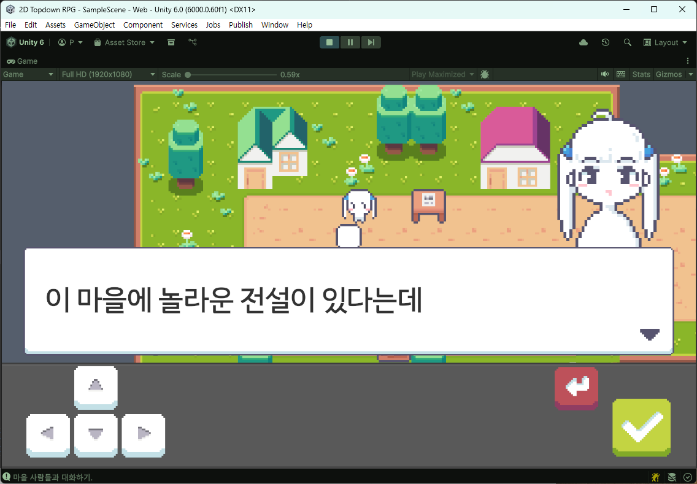
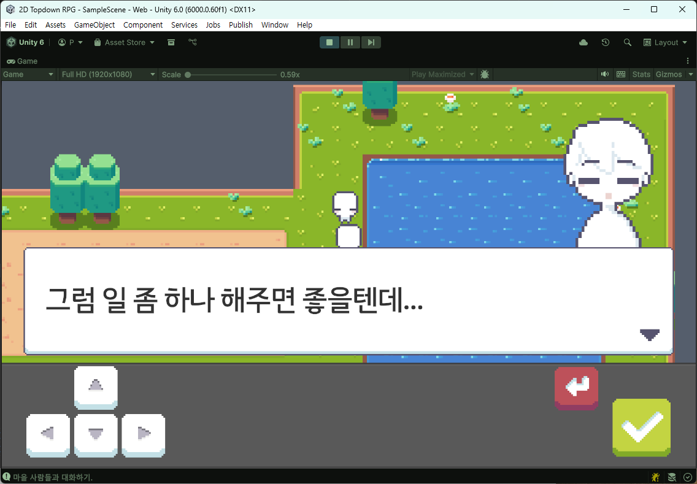

# Unity 2D TopDown RPG

정해진 순서대로 NPC와 대화하여 퀘스트를 완료하는 2D 탑다운 RPG입니다.

---

## Play URL
https://play.unity.com/ko/games/0f0510c5-109c-4049-8b8c-fa49505e8255/2d-topdown-rpg

## Screenshots

## 게임 목표
- 정해진 순서에 따라 NPC와 대화
- 퀘스트를 완료하며 진행
- 퀘스트 진행에 따라 오브젝트 활성/비활성 등 간단한 환경 변화 발생

---

## 게임 방법
1. **이동**: 플레이어 캐릭터를 움직여 월드를 탐험합니다.
2. **상호작용**: NPC나 사물에 접근하여 **스페이스바**를 눌러 대화를 시작합니다.
3. **대화**: 타이핑 효과와 함께 나타나는 대화를 읽습니다. 대화를 완료하면 퀘스트가 진행됩니다.
4. **퀘스트 진행**: QuestManager는 퀘스트 진행 상황에 따라 게임 내 오브젝트를 활성화하거나 비활성화하여 간단한 환경 변화를 유발합니다.

---

## 게임 규칙
- 대화 중에는 플레이어가 움직일 수 없으며, 대화를 모두 마쳐야 계속 진행할 수 있습니다.
- 게임 메뉴를 통해 저장 및 불러오기가 가능합니다.

---

## 조작 방법 (키보드)
- **이동**: WASD 또는 방향키 (상/하/좌/우)
- **상호작용/액션**: 스페이스바
- **메뉴**: Esc (저장, 불러오기, 종료 메뉴)

---

## 학습 자료 정보
- **영상 제목**: [유니티 게임개발] 쯔꾸르같은🗺️탑다운RPG .U18C3
- **채널**: 골드메탈
- **링크**: https://youtu.be/JY-KFx3OsJo

---

## 사용된 유니티 기능 및 구현된 시스템

### Rule Tile 기반 맵 제작
- **Rule Tile**을 활용해 주변 타일 규칙에 따라 스프라이트가 자동 선택되도록 구성
- 통일성 있는 월드를 빠르게 제작

### Pixel Perfect Camera
- 다양한 해상도에서도 픽셀 아트가 깨끗하게 보이도록 유지
- 레트로 2D RPG 비주얼 구현

### 캐릭터 이동 / 상호작용 감지
- 입력(WASD/방향키) 기반 **상/하/좌/우 4방향 이동**
- `Raycast`로 상호작용 오브젝트 및 장애물 감지

### 상황 기반 상호작용 시스템
- 스페이스바 입력으로 NPC/사물과 상호작용
- 상황에 맞는 이벤트(주로 대화) 실행

### 동적 대화 시스템
- **타이핑 효과**로 텍스트 출력
- 퀘스트 진행 상황에 따라 대화 내용이 동적으로 변경

### 선형적 퀘스트 진행
- 정해진 순서대로 특정 NPC와 상호작용하며 목표를 완료
- 게임의 핵심 서사를 선형 구조로 진행

### 2D 스프라이트 애니메이션
- 캐릭터 **걷기/대기** 애니메이션을 4방향으로 구현
- 대화창/커서 등 UI 요소에도 애니메이션 적용

### 저장 / 불러오기
- 플레이어 **현재 위치**
- **퀘스트 진행 상황**
- 위 정보를 저장하고 이어하기 가능

### 모바일 반응형 UI
- 모바일에서도 최적화된 레이아웃과 터치 조작 제공
- 플랫폼 간 일관된 UX를 목표로 UI 설계
